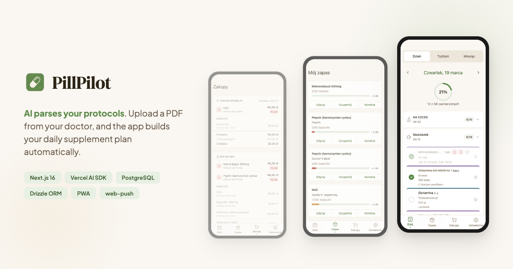
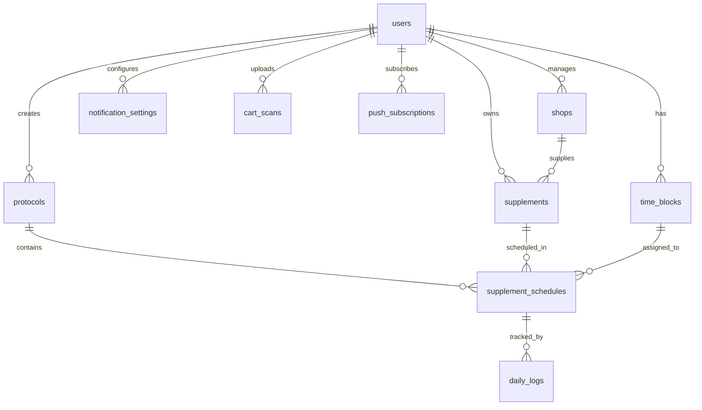

# PillPilot — Fullstack AI-Powered Supplement Tracking

> Born from a real need — while working with a clinical dietitian to treat gut issues, I was juggling 20+ supplements and antibiotics across multiple protocols. Too many pills, too many rules, zero tools to manage it. So I built one.
>
> A fullstack PWA built end-to-end — from PostgreSQL schema design and AI integration to a polished mobile-first UI. Uses AI to parse treatment protocols and automatically link them to your supplement inventory. Zero manual data entry — upload a protocol, and the app builds your daily plan.

**[Live Demo](https://pillpilot.jnalewajk.me)**



---

## What it does

1. **You upload a protocol** — PDF, Excel, DOCX, image, or plain text from your doctor or nutritionist
2. **AI parses and links it** — two-step pipeline (extraction → enrichment) identifies supplements, dosages, and schedules, then links them to your existing inventory
3. **Dashboard shows your daily plan** — supplements grouped by time blocks (Fasting, Breakfast, Lunch, etc.) with one-tap check-off and progress tracking
4. **Stock manages itself** — every check-off decrements inventory, forecasts when items run out, and flags low-stock supplements before you need them

## Architecture

```
src/
├── app/                          # Next.js App Router
│   ├── (auth)/login/             # Google OAuth login
│   ├── (app)/(main)/             # Authenticated shell with bottom nav
│   │   ├── dashboard/            # Daily, weekly, and monthly views
│   │   ├── stock/                # Inventory management
│   │   ├── shopping/             # Shopping list with price comparison
│   │   ├── settings/             # Protocols, time blocks, account
│   │   └── protocol/             # Upload, AI preview, manual form, edit
│   └── api/                      # Route handlers (auth, AI parsing)
├── features/                     # Feature modules with strict isolation
│   ├── dashboard/                # Check actions, supplement rows, progress rings
│   ├── protocol-wizard/          # Upload → AI parse → preview → save flow
│   ├── supplements/              # CRUD, schedule forms, stock calculator
│   ├── stock/                    # Stock list, restock dialog, forecast
│   ├── shopping/                 # Cart scanning, shop management, prices
│   └── settings/                 # Protocol/time-block/account management
└── shared/                       # App-wide: DB, repositories, auth, AI, UI
```

Each feature is fully isolated — no cross-feature imports. App routes access features through barrel `index.ts` files only.

### AI Parsing Pipeline

The protocol parsing uses a **two-step approach** to balance cost and accuracy:

1. **Extraction** (Haiku) — pulls raw supplement data, dosages, and scheduling from the uploaded document
2. **Enrichment** (Sonnet) — receives the user's existing supplements and time blocks (with IDs), links parsed items by ID, assigns confidence scores (0–1), and fills in cycling/timing details

The AI receives real inventory data, so it links to existing supplements instead of creating duplicates.

### Stock Forecasting

`forecastDaysInStock()` runs a **day-by-day consumption simulation** that respects cycling schedules (`cycleDaysOn`/`cycleDaysOff`), `startDayOffset`, and `durationDays` across all active protocols. Used in dashboard low-stock warnings, stock page sorting, and the shopping list.

## Key technical decisions

- **PostgreSQL schema with Drizzle ORM** — designed the full data model (8+ tables, complex relations), migrations, and a repository pattern with interface + implementation co-located per file
- **Two-step AI pipeline** — cost-optimized architecture: cheap model (Haiku) for extraction, powerful model (Sonnet) for enrichment and inventory linking. Prompt engineering handles confidence scoring and ID-based matching
- **next-safe-action for all mutations** — type-safe server actions with Zod validation, consistent error handling across every write operation
- **SupplementSchedule as the core join table** — links Protocol ↔ Supplement ↔ TimeBlock directly, holding all per-schedule fields (dosage, cycling, timing, sort order). No intermediate `ProtocolSupplement` table
- **Multi-protocol aggregation** — one supplement can appear in multiple protocols. Dashboard flattens all active schedules into a single daily plan respecting each protocol's cycles independently
- **Push notifications via web-push** — per-time-block notification toggles with VAPID keys, timer-based reminders for cooldown and wait periods
- **Self-hosted on Hetzner VPS** — Docker deployment via Dokploy, full control over infrastructure and data

## Tech stack

| Layer | Technology |
|---|---|
| Framework | Next.js 16 (App Router, Server Actions, Cache Components) |
| Language | TypeScript (strict) |
| UI | React 19, Tailwind CSS 4, shadcn/ui (base-ui), DnD Kit |
| Database | PostgreSQL + Drizzle ORM (repository pattern) |
| Auth | Better Auth (Google OAuth) |
| AI | Vercel AI SDK + Anthropic (Haiku + Sonnet) |
| Validation | Zod + React Hook Form + next-safe-action |
| File Parsing | exceljs, mammoth (DOCX), sharp (image compression) |
| Notifications | web-push (VAPID) |
| i18n | next-intl (Polish) |
| Quality | Biome (lint + format), Vitest, Knip (dead code) |
| Infrastructure | Docker, Hetzner VPS + Dokploy |

## Database schema

The core model centers on `supplement_schedules` — a three-way join linking **Protocol ↔ Supplement ↔ TimeBlock**. This single table holds dosage, cycling rules, and timing, enabling multi-protocol aggregation where one supplement box can be shared across protocols. `daily_logs` track check-offs per schedule per day, while `shops` and `cart_scans` power the shopping/price comparison module.



## Getting started

```bash
git clone https://github.com/jaqubowsky/pill-pilot.git
cd pill-pilot
pnpm install
cp .env.example .env            # fill in required values
pnpm drizzle-kit migrate        # run database migrations
pnpm dev                        # start dev server
```

Requires Node.js 20+ and a PostgreSQL database.

## Author

**Jakub Nalewajk** — Fullstack Developer

- Portfolio: [jnalewajk.me](https://jnalewajk.me)
- GitHub: [@jaqubowsky](https://github.com/jaqubowsky)
- LinkedIn: [jakub-nalewajk](https://www.linkedin.com/in/jakub-nalewajk/)
